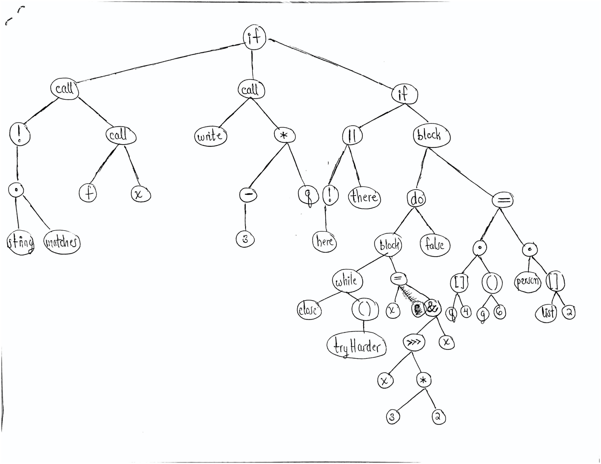

# Here are a few Ohm grammar rules from the Ada programming language:

* Exp     = Exp1 ("and" Exp1)* | Exp1 ("or" Exp1)*
* Exp1    = Exp2 (relop Exp2)?
* Exp2    = "-"? Exp3 (addop Exp3)*
* Exp3    = Exp4 (mulop Exp4)*
* Exp4    = Exp5 ("**"  Exp5)? | "not" Exp5 | "abs" Exp5
* comment = "--" (~"\n" any)* "\n"

## a.) What can you say about the relative precedences of and and or?

The keywords `and` and `or` have the same precedence because they occupy the same line of the grammar. Because they are the very first line of the grammar, their precedence is the lowest.

## b.) If possible, give an AST for the expression X and Y or Z. (Assume, of course, that an Exp5 can lead to identifiers and numbers, etc.) If this is not possible, prove that it is not possible.

The expression `X and Y or Z` is not possible because expressions involving `and` and `or` must include expressions in the form of `Exp1`. Going down the grammar, there are no points at which we could recurse back to `Exp`, therefore expressions with multiple And and Ors could not be made.

### c.) What are the associativities of the additive operators? The relational operators?

The additive operators are right-associative. The value `Exp1` evaluates from right to left, or walking up in terms of a parse tree; for example, 

````
    Exp2 relop Exp2 relop Exp2 = Exp2 (relop Exp2 (relop Exp2))
````

The relational operators are non-associative. `Exp2` cannot chain operations, such that its input is not compatible with its output `Exp3`.

### d.) Is the not operator right associative? Why or why not?

The `not` operator is right associative. `Exp5` is evaluated first, then it is negated with the `not` keyword.

### e.) Why do you think the negation operator was given a lower precedence than multiplication?

Inputs cannot be chained with inputs, so expressions involving multiplicative operators cannot have negative values, for individual values or parenthetical subexpressions both, without the `not` keyword. `-` has the same precedence as the additive operators, so it is possible to negate the first term in an additive expression.

### f.) Give an abstract syntax tree for the expression -8 * 5.



### g.) Suppose the grammar were changed by dropping the negation from Exp2 and adding - Exp5 to Exp4. Give the abstract syntax tree for the expression -8 * 5 according to the new grammar.


